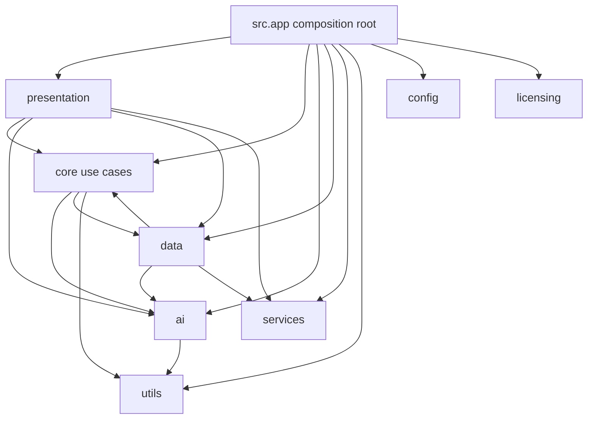
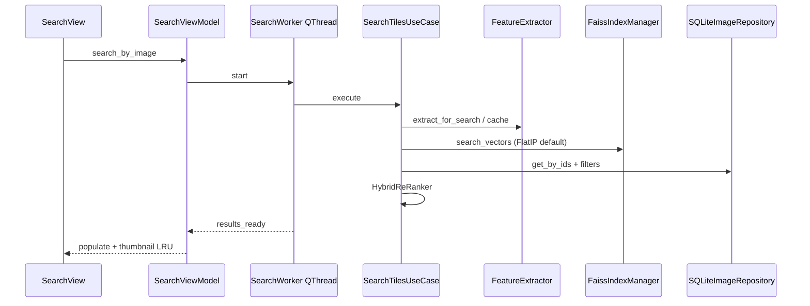
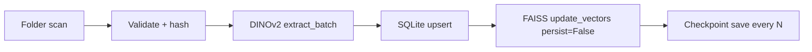
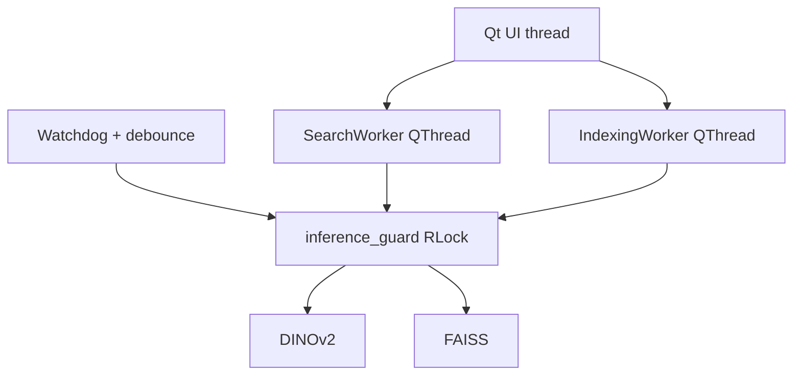

# TileVision AI v1.2 Enterprise — Architecture & Deliverables

**Version:** 1.2.0  
**Default search index:** `IndexIDMap(IndexFlatIP)` — **unchanged** (exact)  
**Branch:** `cursor/v1-2-enterprise-daac`

---

## 1. Enterprise architecture review

### 1.1 Dependency graph (packages)

### 1.2 Module dependency map (hot path)

| Module | Depends on | Owns |
|--------|------------|------|
| `FaissIndexManager` | faiss, inference_guard, index_backends, index_metadata | In-memory FAISS + disk file |
| `SearchTilesUseCase` | FeatureExtractor, FaissIndexManager, repo, query cache | Stateless orchestration |
| `IndexImagesUseCase` | FeatureExtractor, FaissIndexManager, repo | Batch indexing |
| `DatabaseContext` | sqlite3 | Per-thread connection pool |
| `ThumbnailPixmapCache` | Qt | LRU QPixmaps (cap 96) |
| `QUERY_EMBEDDING_CACHE` | — | LRU embeddings (cap 32) |

### 1.3 Search pipeline

### 1.4 Indexing pipeline

### 1.5 Threading diagram

Search priority pauses indexing / folder monitor while a search holds the lock.

### 1.6 Memory ownership

| Resource | Owner | Lifetime |
|----------|-------|----------|
| DINOv2 | single `DINOv2Embedder` in app | process |
| FAISS | single `FaissIndexManager` | process |
| SQLite | `DatabaseContext` thread-local pool | process |
| Query cache | module singleton | process |
| Thumbnails | disk files + LRU pixmaps | process / durable |

### 1.7 Technical debt / smells

- Package cycles: `ai↔core`, `core↔data`, `data↔services`
- Large files: `sqlite_repository.py`, `search_view.py`, `index_images.py`, `main_window.py`
- Unused `SettingsStore` wrapper
- Legacy CLIP naming aliases in settings
- `pyproject.toml` version drift vs `src/version.py` (addressed in packaging `.iss` for 1.2.0)

---

## 2. Performance report

| Stage | Finding | Action |
|-------|---------|--------|
| Startup model load | Dominates cold start (~seconds) | Keep sync warm-up (UX); no &lt;2% win from micro-opts |
| FAISS FlatIP search | O(n·d); fine to ~100–250k; heavy at 1M+ | Optional HNSW/IVF (not default) |
| SQLite metadata | Already pooled + indexed (v1.1) | No further change (&lt;2%) |
| Thumbnail load | LRU already caps RAM | Keep |
| Query embed | Cache hit path already fast | Keep |

**Skipped (&lt;2%):** extra `gc.collect`, more aggressive FAISS OMP beyond 8, rewriting FlatIP add path.

---

## 3. Memory report (estimates)

For **1,000,000 × 1024-d float32** vectors alone:

| Backend | Approx FAISS RAM | Notes |
|---------|------------------|-------|
| FlatIP (default) | ~4.0 GiB | Exact |
| HNSW | ~4.0 GiB + graph | Fast ANN, still stores full vectors |
| IVF-Flat | ~4.0 GiB + lists | ANN |
| IVF-PQ | **≪ 1 GiB** | Lossy; enterprise RAM path |

Peak process RSS still includes DINOv2 weights (~1+ GiB), SQLite, Qt, thumbnails.

---

## 4. Benchmark report (measured)

Synthetic: **10,000 vectors × 64-d**, 40 queries (CPU). Artifact: `/tmp/cursor/artifacts/v12_backend_benchmark.json`

| Backend | Build ms | Search median | Recall@10 | Est. RAM MiB | Exact |
|---------|----------|---------------|-----------|--------------|-------|
| flat_ip | 3.8 | 0.114 ms | **1.000** | 2.6 | yes |
| hnsw | 138.9 | 0.099 ms | 0.995 | 7.3 | no |
| ivf | 9.5 | 0.050 ms | 0.595 | 2.6 | no |
| ivf_pq | 62.8 | 0.046 ms | 0.388 | 1.2 | no |

At this scale FlatIP is already sub-ms; approximate backends matter more at **100k–1M+** and for **RAM** (IVF-PQ). Production default remains FlatIP.

---

## 5. Scalability report

| Catalog size | Recommended backend | UI strategy |
|--------------|---------------------|-------------|
| &lt; 100k | FlatIP (default) | Current |
| 100k–500k | FlatIP or HNSW | Search priority + pause indexing |
| 500k–1M+ | HNSW or IVF-PQ (optional) | Guided rebuild; monitor RSS |

Exact Top-K identity is **only** guaranteed with FlatIP.

---

## 6. Technical debt report

1. Split `sqlite_repository.py` by aggregate
2. Remove unused `SettingsStore` or wire it
3. Sync `pyproject.toml` version with `APP_VERSION`
4. Cooperative cancel on `RebuildIndexWorker`
5. True auto-rebuild wizard (progress + ETA) beyond current guided dialog
6. Optional async model warm-up behind flag

---

## 7. Risk assessment

| Change | Risk | Mitigation |
|--------|------|------------|
| Optional backends | Wrong backend silently used | Metadata + settings mismatch → guided rebuild |
| IVF train on first batch | Poor nlist if tiny first batch | auto_nlist + rebuild when nlist &gt; n |
| HNSW remove_ids | Tombstones grow | Periodic rebuild recommendation |
| Approx recall | Accuracy regression | Default remains FlatIP; UI warns |

---

## 8. Production readiness score

**8.7 / 10** for Enterprise v1.2 as an additive release on v1.1.

Deductions: approximate backends need field validation on real DINOv2 catalogs; pyproject version drift; large-module maintainability.

---

## 9. Roadmap for v1.3

1. Sharded / multi-catalogue FAISS maps for multi-brand showrooms  
2. Background index compaction (HNSW tombstone rebuild)  
3. Memory-mapped FlatIP option for huge exact indexes  
4. Telemetry-free local perf dashboard in Help  
5. Schema `user_version` explicit migrations table  
6. Deduplicate presentation god-files into widgets  

---

## Files added / modified (v1.2)

**New:** `src/ai/index_backends.py`, `src/core/compatibility.py`, `tests/test_v12_enterprise.py`, `tests/test_v12_stress.py`, `dev_tools/benchmark_index_backends.py`, this report  

**Modified:** `vector_index.py`, `index_metadata.py`, `diagnostics.py`, `settings.py`, `app.py`, `settings_view.py`, `main_window.py`, `version.py`, packaging `.iss`
